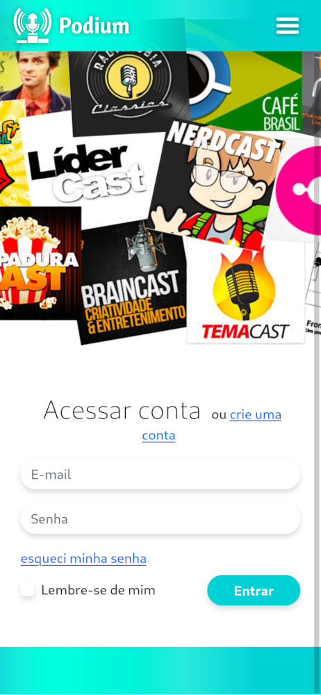
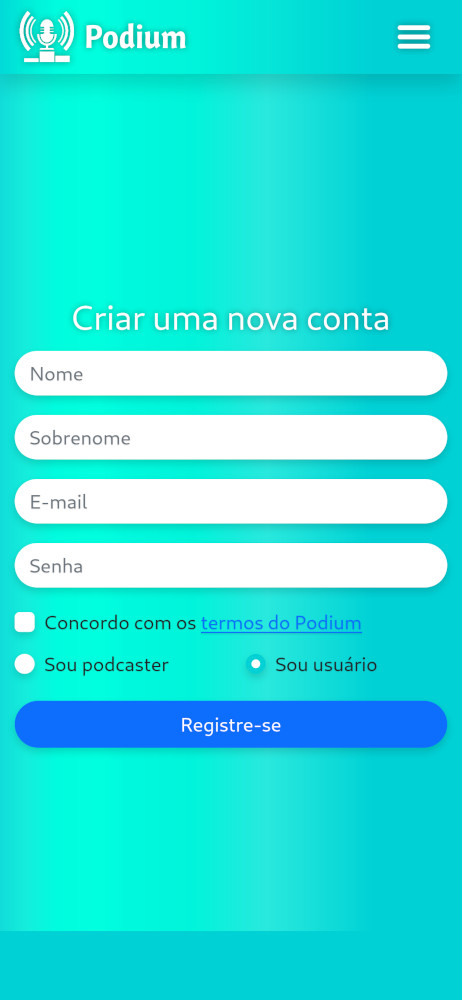

# Podium

O Podium é um aplicativo de Podcasts onde você pode encontrar podcasts por regiões através de um mapa.
<div style="display: flex; justify-content: center">
    </img>
</div>
<div style="display: flex; justify-content: center; margin-bottom: 2em;">
    <i>*Função ainda não implementada!</i>
</div>
<div style="display: flex; justify-content: center; margin-bottom: 2em;">
    </img>
</div>
<div style="display: flex; justify-content: center; margin-bottom: 2em;">
    </img>
</div>
<div style="display: flex; justify-content: center; margin-bottom: 2em;">
    </img>
</div>


## Uso

Atualmente é possível apenas se cadastrar e realizar um login. O Podium é um trabalho que está em andamento!

## Contribuir
Clone o nosso projeto e envie a sua pull request!
```bash
git clone https://github.com/projetoPodium/Podium.git
```

## License
[MIT](https://choosealicense.com/licenses/mit/)